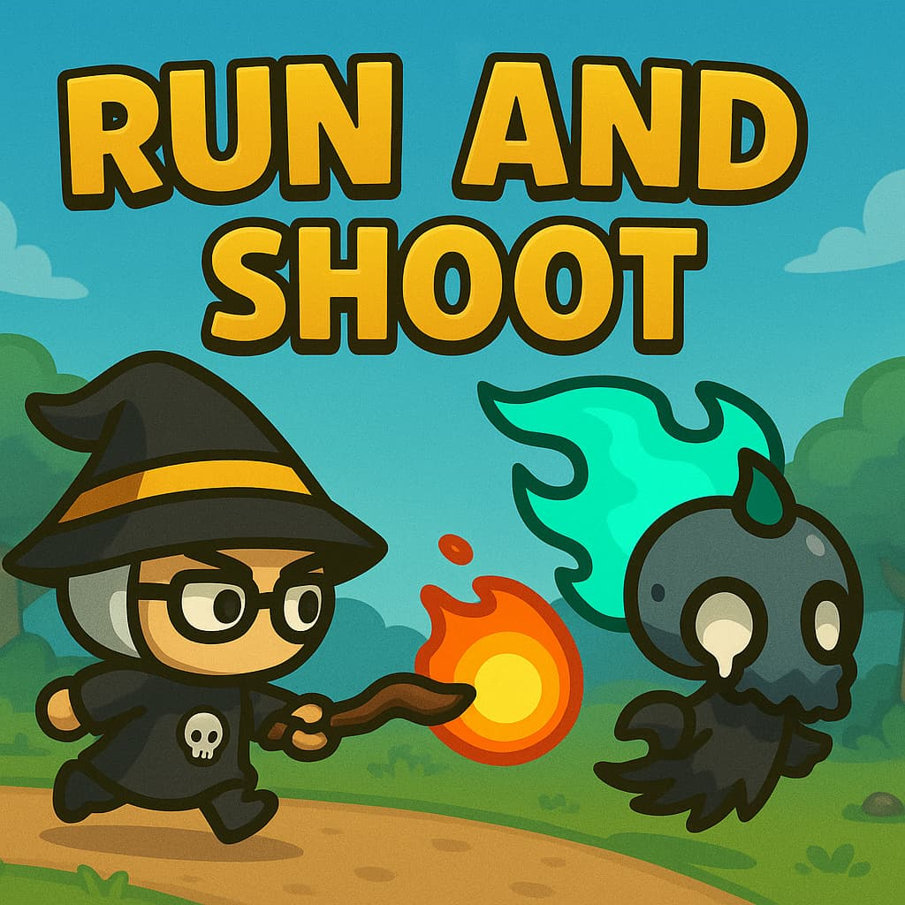

# ***Java + Swing Game for Ashkelon College***

🕹️ Project Description (Basic Overview)
This is a 2D action game using Java Swing. The structure shows a clean separation of concerns, with code grouped into logical packages:

🔹 **entities/**
Contains all core game objects:

1. Entity: Base class for movable game objects.
2. Player, Enemy, BossEnemy, FastEnemy: Different actors with behaviors.
3. Projectile: Logic for projectiles fired by the player.

🔹 **main/**
Houses the core game engine classes:

1. Game: The main controller.
2. GameLoop: Manages the update/render cycle.
3. GamePanel: The canvas where everything is drawn.

🔹 **menu/**
Handles navigation between screens:

Menus like MainMenu, PauseMenu, InstructionScreen, etc.

Navigation: Probably helps switch between different panels.

🔹 **utils/**
Utility and manager classes:

ProjectileManager: Controls all projectile updates and collisions.

EnemySpawner: Spawns enemies.

HealthBar, ScoreManager, SoundManager: UI and gameplay utilities.

🔹 **Resources/**
Assets used in the game:

Sprites, backgrounds, music, UI buttons, etc.

***Project architecture:***

    SwingProject/
    ├── src/
    │   └── main/
    │       ├── java/
    │       │   ├── entities/
    │       │   │   ├── BossEnemy
    │       │   │   ├── Enemy
    │       │   │   ├── Entity
    │       │   │   ├── FastEnemy
    │       │   │   ├── Player
    │       │   │   └── Projectile
    │       │   ├── main/
    │       │   │   ├── Game
    │       │   │   ├── GameLoop
    │       │   │   └── GamePanel
    │       │   ├── menu/
    │       │   │   ├── InstructionScreen
    │       │   │   ├── MainFrame
    │       │   │   ├── MainMenu
    │       │   │   ├── Navigation
    │       │   │   └── PauseMenu
    │       │   └── utils/
    │       │       ├── EnemySpawner
    │       │       ├── HealthBar
    │       │       ├── ProjectileManager
    │       │       ├── ScoreManager
    │       │       └── SoundManager
    │       └── Resources/
    │           ├── Backgrounds/
    │           ├── Buttons/
    │           ├── Enemies/
    │           ├── Music/
    │           ├── Player/
    │           └── Projectiles/

***Projectile calculations:***

                    (targetX, targetY)
                             ●  (Mouse click)
                             ^
                             | 
                             | dy
    (startX, startY)         |
        ● ------------------>|
    (Player)      dx

    tan(targetY - startY, targetX - startX) = angle
    cos(angle) = dx
    sin(angle) = dy
